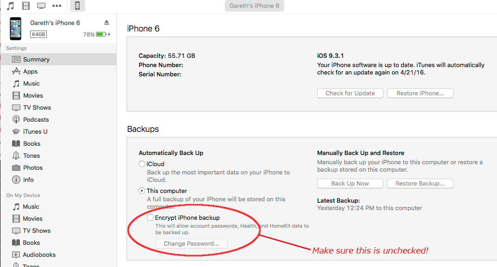
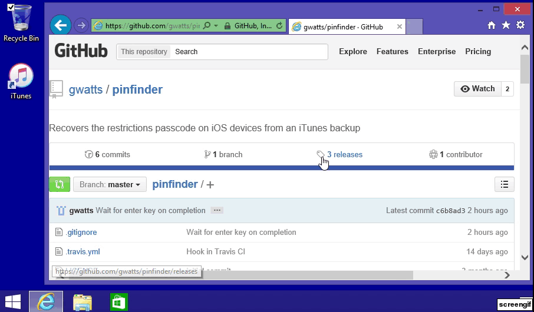
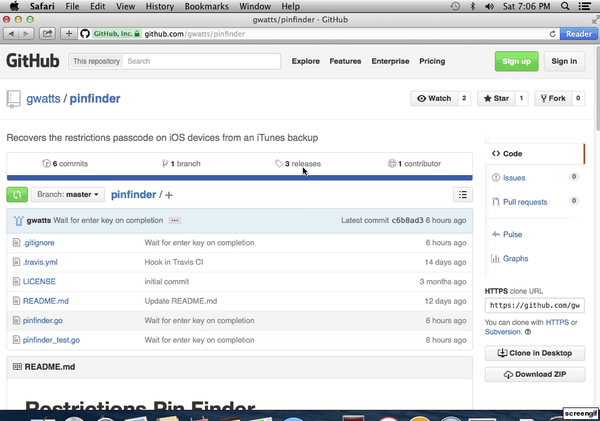

# iOS Restrictions Passcode Finder

[](https://travis-ci.org/gwatts/pinfinder)

Pinfinder is a small application for Mac, Windows and Linux which attempts to to find the restrictions passcode
for an iOS device (iPhone, iPad or iPod Touch) by brute force examination of its iTunes backup, without needing to jailbreak the device.

It was written after the PIN was forgotten for a kid's iPod Touch and wiping it 
would of been more work than writing this little program.

**NOTE**: This program will **not** help you unlock a locked device - It can only help recover the restrictions
passcode as found in `Settings -> General -> Restrictions`.  More information about Restrictions
can be found [at Apple's web site](https://support.apple.com/en-us/HT201304).

[This blog post]( https://nbalkota.wordpress.com/2014/04/05/recover-your-forgotten-ios-7-restrictions-pin-code/)
(which I didn't write, but inspired this program) mentions pinfinder and contains comments from many people who have used
pinfinder successfully.

The program is free to download, use and redistribute (see the [license file](https://raw.githubusercontent.com/gwatts/pinfinder/master/LICENSE)).

## Download

Binaries for Linux, Mac and Windows can be found at the
[latest releases](https://github.com/gwatts/pinfinder/releases) page.

## Instructions

Operating-specific instructions are below.  In most cases, simply running the program (working around
OS specific security restrictions) should deliver the right result.  Take a look at the Troubleshooting
section if you run into issues.

By default, it will print out the passcode for all devices it can find an unencrypted backup for, displaying
the most recently backed up first.

**NOTE**: The "Encrypt local backup" option **must** be disabled in iTunes for your device so that pinfinder
can read the file that contains the passcode.  You'll see a "backup is encrypted" message in pinfinder if it's on.




### Windows

1.  Backup the device using [iTunes](https://www.apple.com/itunes/download/) on a desktop or laptop computer.
NOTE: The "encrypt backup" option *must be disabled* in iTunes.
2. Download pinfinder from the [latest releases](https://github.com/gwatts/pinfinder/releases) page.
3. Select "Open" when prompted by the web browser
4. Drag `pinfinder` from the .zip file to the Desktop

#### For Windows XP/Vista ####

Double click the pinfinder icon to run the program.

#### For Windows 7, 8 or 10 ####

* Right-click on the start button, and select `Command Prompt`
* Drag the `pinfinder` icon from the Desktop to the command prompt window, and press return to run it.



_[click here for full size version of above image](https://raw.githubusercontent.com/gwatts/pinfinder/giftest/docs/windows-demo.gif)_


### Mac


1.  Backup the device using iTunes on a desktop or laptop computer.
NOTE: The "encrypt backup" option *must be disabled* in iTunes.
2. Download pinfinder from the [latest releases](https://github.com/gwatts/pinfinder/releases) page.
3. Select the tar.gz file in the download list to open it.
4. Right-click on pinfinder and select `Open With` -> `Terminal` - You will receive a warning about the program 
being written by an unknown developer, which you'll need to accept to use it.




_[click here for full size version of above image](https://raw.githubusercontent.com/gwatts/pinfinder/giftest/docs/mac-demo.gif)_

### Linux

Download, extract and run the binary.


```
$ ./pinfinder
PIN Finder 1.3.0
http://github.com/gwatts/pinfinder

IOS DEVICE                                BACKUP TIME                RESTRICTIONS PASSCODE
John Doe’s iPad Mini                      Nov 25, 2015 01:39 PM PST  1234
John Doe's iPhone 6                       Nov 25, 2015 12:15 PM PST  3456
John Doe's iPhone 5S                      Sep 19, 2014 03:57 PM PDT  No passcode found
```


## Troubleshooting

By default the program will look for the restrictions passcode for every device that has been
backed up, and return results of the most recently backed up first.

You can also specify the backup directory explicitly on the command line to examine the backup 
for a single device:

On Mac it will be in the home directory as /Library/Application Support/MobileSync/Backup/<something>
eg.

```
/Users/johndoe/Library/Application\ Support/MobileSync/Backup/51957b68226dbc9f59cb5797532afd906ba0a1f8
```

On Windows Vista or later it will be something like:

```
\Users\John Doe\AppData\Roaming\Apple Computer\MobileSync\Backup
```

Use whatever directory is the latest as the argument to pinfinder:

```
$ pinfinder /Users/johndoe/Library/Application\ Support/MobileSync/Backup/51957b68226dbc9f59cb5797532afd906ba0a1f8
```

The program will find the plist containing the hashed version of the passcode and will then find
the passcode that matches that hash (which can then be used with your device).
It shouldn't take more than a few seconds to run.

If the program fails to find the passcode for your device, and you're sure it's searching the right
backup, please [open an issue](https://github.com/gwatts/pinfinder/issues) and copy and paste
the text the program prints in the issue so I can help.


## Compiling this program

If you don't want to use one of the [pre-compiled binaries](https://github.com/gwatts/pinfinder/releases)
you can compile it yourself.

1. [Download and install Go](https://golang.org/doc/install) - Be sure to follow the instructions to [setup a workspace](https://golang.org/doc/code.html#Workspaces) and set a `GOPATH` environment variable to suit
2. run `go get github.com/gwatts/pinfinder`

If you just want to compile the program as quick as possible, install Go from the web site above, and run the following steps to build and install it to `~/pinfinder/bin/pinfinder`

```bash
cd ~
mkdir ~/pinfinder
cd pinfinder
mkdir src bin pkg
export GOPATH=~/pinfinder
go get github.com/gwatts/pinfinder
bin/pinfinder
```

## Other resources

Inspired with thanks by information found here:

https://nbalkota.wordpress.com/2014/04/05/recover-your-forgotten-ios-7-restrictions-pin-code/


## Other Notes

Last tested with iOS 8 through 10.0.2 on OS X 10.10, 10.11, Windows XP and Windows 8 with iTunes 12.5
